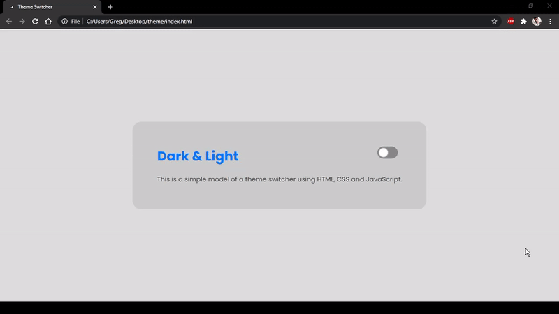

<h1 align="center">Dark & Light</h1>

## Descrição ✍️

Simples projeto, feito para aplicar o dark mode no site através das variáveis do css e fazendo a troca utilizando javascript.
 &nbsp;

  

 <a href="#objetivo">Objetivo</a> •
 <a href="#tecnologias">Tecnologias</a> •
 <a href="#features">Features</a> •
 <a href="#autor">Autor</a>

&nbsp;

## Objetivo 🚀

Hoje em dia, os sites e apps estão implementando cada vez mais essa funcionalidade, sendo assim, é importante sabermos lidar com isso.

&nbsp;

## Tecnologias 👩‍💻

  HTML
  &nbsp;

  CSS
  &nbsp;
  
   JS

&nbsp;

## Features 🆕

  ✅ Trocar do light mode para o dark mode;
  &nbsp;

  ✅ Forçar o tema para permanecer ativo ao dar reload na página.

&nbsp;

> Status do Projeto: Concluido ✔️

&nbsp;

## Autor
<a style="text-decoration: none;" href="https://github.com/olagregs">
  
  
Gregory Ferreira 💻

</a>

Made with ❤️ and ☕ by me 😁

&nbsp;